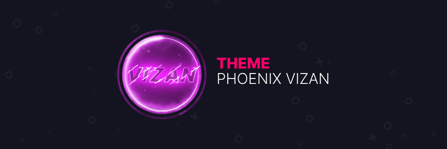

  

 

# Current Theme Design (OmoriBoy Sunburn)  

# These are just my personal custom presets for different themes.  
Load the theme you want by editing manifest.json to load the version you want (latest by default)  
So I decided to Deprecate Aroma-White due to instability issues and lag  
These are custom presets that I made from themes (which are linked)  
Do note that I don't really claim anything on these  
Supporting Vizality, Powercord, BetterDiscord, Stylus, CumCord (soon), and GooseMod (soon)  
# Installing!  
Vizality: Clone into Vizality/Addons/Themes  
Powercord: Clone into Powercord/src/powercord/themes  
BetterDiscord: Download PhoenixVizan.theme.css to your themes folder  
Stylus: Just visit https://github.com/PhoenixAceVFX/Phoenix-Vizan/raw/main/PhoenixVizan.user.css
CumCord: You need Cumstain and you can find it in the Cumstain store  
GooseMod: Just visit the GooseMod Store!  
# Current Theme  
LilyPichu - https://github.com/NYRI4/LilyPichu  
# Archived Old Builds  
This was done to make things more clean  
