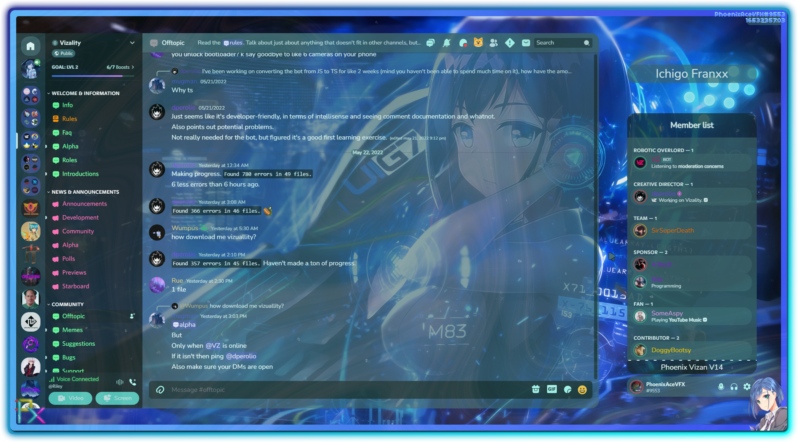

  

 

# Current Theme Design [Designed by TwoTrick] (OMORICORD)  

# These are just my personal custom presets for different themes.  
Load the theme you want by editing manifest.json to load the version you want (latest by default)  
So I decided to Deprecate Aroma-White due to instability issues and lag  
These are custom presets that I made from themes (which are linked)  
Do note that I don't really claim anything on these  
Also use with Vizality or Powercord  
# Original Themes  
Discord+ - https://github.com/PlusInsta/discord-plus  
ClearVision - https://github.com/ClearVision/ClearVision-v6  
SoftX - https://github.com/DiscordStyles/SoftX  
LilyPichu - https://github.com/NYRI4/LilyPichu  
Crearts - https://github.com/CorellanStoma/CreArts-Discord
